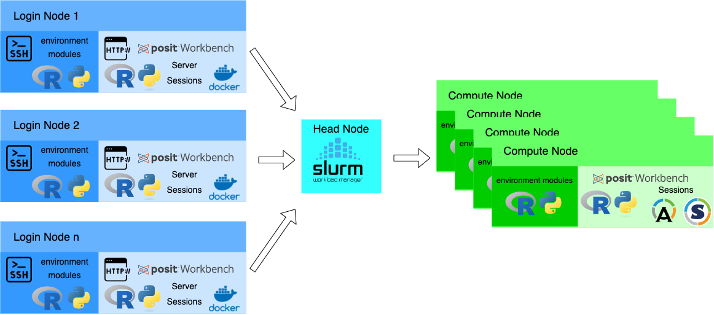

# workbench-docker-singularity

This repository documents a minimally invasive way of using Posit Workbench on a SLURM based HPC cluster.

The idea is to use docker on the SLURM head node or one of the login/submit nodes and run all the Workbench sessions in Singularity/Apptainer container.

By default this setup will also allow the launch of local sessions via the local launcher.



Each login node in this architecture will host a standalone workbench environment (no HA/LB) and will hence allow different user groups to use the same on each login node. 

## Requirements

- fully functional SLURM cluster
- shared storage configured across compute nodes and login/submit/head nodes to host Posit Workbench metadata such as 
  - Singularity/Apptainer containers
  - Session information
  - General Workbench metadata
  - ...
- Docker client including `docker-compose` configured on the login/submit/head nodes
- Access to a docker registry (In the absence of a docker registry you can set up a private registry - see below)

## Instructions

### Global variables

The following global variables can be defined as environment variables. Their respective default value is listed as well: 

- shared storage location: `PWB_SHARED_STORAGE` : `/opt/rstudio/pwb` 
- SLURM config directory: `SLURM_CONF_DIR` : `/opt/slurm/etc`
- SLURM version: `SLURM_VERSION`: `23.02.7`
- Posit Workbench version: `PWB_VERSION` : `2024.04.2`
- Linux distribution: `OS_VERSION`: `ubuntu2204` (other allowed value is `ubuntu2004` for Ubuntu 20.04 LTS (Focal))
- SLURM Launcher name `LAUNCHER_NAME`: `slurmhpc`
- PWB License key `PWB_LICENSE`: (you will get this from your CS or Sales person)

Note: Variables `PWB_SHARED_STORAGE`, `LAUNCHER_NAME` and `SLURM_CONF_DIR` as well as `PWB_LICENSE` must always be defined in the shell where the below command are executed

### Shared storage location

This location will be used for

- Posit Workbench shared storage (workbench metadata, subfolder `shared-data`)
- Location of Singularity/Apptainer images (subfolder `containers`)
- Workbench configuration files (subfolder `${LAUNCHER_NAME}/etc/rstudio`)
- renv global package cache (subfolder `renv-cache`)

### Prepare Workbench configuration files

For convenience, a wrapper script was designed to deploy a set of standard configuration files for Posit workbench. This can be called via

```bash
./scripts/conv.sh
```

### Build Docker containers

We will build a docker container for Posit Workbench and for r-session-complete. Posit Workbench is the main container that will run on the login/submit/head nodes. r-session-complete is a intermediate container that will be converted into singularity as part of the process.

The whole build process is all integrated into `docker-compose.yml`. Once you made sure that all the environment variables are set to meet your needs and are appropriate for your environment, you can hit

```bash
docker-compose build 
```

Note: The `munge.key` needs to be copied into the `munge` folder of the repository before launching the container builds. 

#### Important details for the Dockerfiles

For both containers, we are rebuilding SLURM binaries within the container. Customers that have a set of bespoke plugins need to make sure that they build them into the Docker container.

The available R and Python versions are given by the respective Posit provided containers. More details on those containers can be found on [github](https://github.com/rstudio/rstudio-docker-products/). Additional [R](https://docs.posit.co/resources/install-r.html) and [Python](https://docs.posit.co/resources/install-python.html) versions can be added at the customers discretion. Especially the R installations should be added into the Dockerfiles before the R configuration. 

The R setup is following this approach:

- Use [Public Posit Package Manager](https://packagemanager.posit.co/)
- Include Bioconductor repositories and make them usable via  `install.packages()`
- Set CRAN repository to a time-based snapshot that is set to the date of the (n+1) bioconductor release. Let's assume the R version is compatible with Bioconductor 3.15, the CRAN time-based snapshot is set to the release date of Bioconductor 3.16. This will ensure maximum compatibility between CRAN and Bioconductor and also considerably improve reproducibility of package versions. If the compatible Bioconductor release is the latest available, CRAN will also point to the latest snapshot. 
- Preinstall all necessary R packages for the RStudio IDE integration into a site-library. This is done to reduce the storage duplication of multiple users installing tidyverse and all the 100+ dependent packages into their home-directory.
- For users that want to leverage `renv` a global package cache is configured.

This will build the `posit-workbench-hpc` docker container as well as `r-session-complete-hpc`.

### Transform r-session-complete into a singularity image file 

Once the `r-session-complete-hpc` image has been built, we need to transform it into a singularity file. This can be done via (run as root)

```bash
mkdir ${PWB_SHARED_STORAGE}/${LAUNCHER_NAME}/containers
for i in `docker images | grep ^r-session-complete-hpc | awk '{print $2}'`
do
    docker tag r-session-complete-hpc:$i localhost:5000/r-session-complete-hpc:$i 
    docker push localhost:5000/r-session-complete-hpc:$i 
    SINGULARITY_NOHTTPS=1 singularity build ${PWB_SHARED_STORAGE}/${LAUNCHER_NAME}/containers/$i.sif docker://localhost:5000/r-session-complete-hpc:$i
done
```

where I am assuming that there is a local docker registry available on localhost. The above approach will transform any docker image named `r-session-complete-hpc` into a singularity image file and store it in the `containers` subdirectory of the shared storage folder.

Note: You can start your own registry via `docker run -p 5000:5000 -d registry:2`. And the naming convention for the singularity images is of course up-for-debate. Feel free to change at your discretion. 

### Deploy the Workbench container

Finally we can start the container by simply running 

```bash
docker-compose up -d 
```

and eventually `docker-compose ps` will report the `posit-workbench-hpc` container as up and running. Note that the `r-session-complete-hpc` container will be marked as failed but this is ok given the fact that we only will run it as singularity container.


## Things to be aware of

The setup above will lead to a fully functional setup for Workbench including running Workbench sessions and Workbench jobs both locally and against a SLURM cluster. 

If a user desires to use a compute framework in a local session that needs bidirectional network connections (or more precisely needs to call back to the local sessions), you will need to 
 
- setup a DNS alias for your docker container (`posit-workbench` by default) on all compute nodes 
- configure the `posit-workbench-hpc` service in `docker-compose.yml` to additionally listen on a port range (say `60000...60200`)
- configure SLURM to have `slurmd` only communicate in the same port range via setting `SrunPortRange=60000-60200` in `slurm.conf`. 
- configure your compute framework to adhere to this port range
  - `clustermq`: Use `clustermq.ssh.hpc_fwd_port=60000:60200`
  - `mirai`: Use `ports=sample(60000:60200,1)` in your `host_url()` call.

## Further readings

- [General Workbench installation](https://docs.posit.co/ide/server-pro/getting_started/installation/installation.html)
- [Step-by-step SLURM integration](https://docs.posit.co/ide/server-pro/integration/launcher-slurm.html)
- [SLURM Launcher reference guide](https://docs.posit.co/ide/server-pro/job_launcher/slurm_plugin.html)
